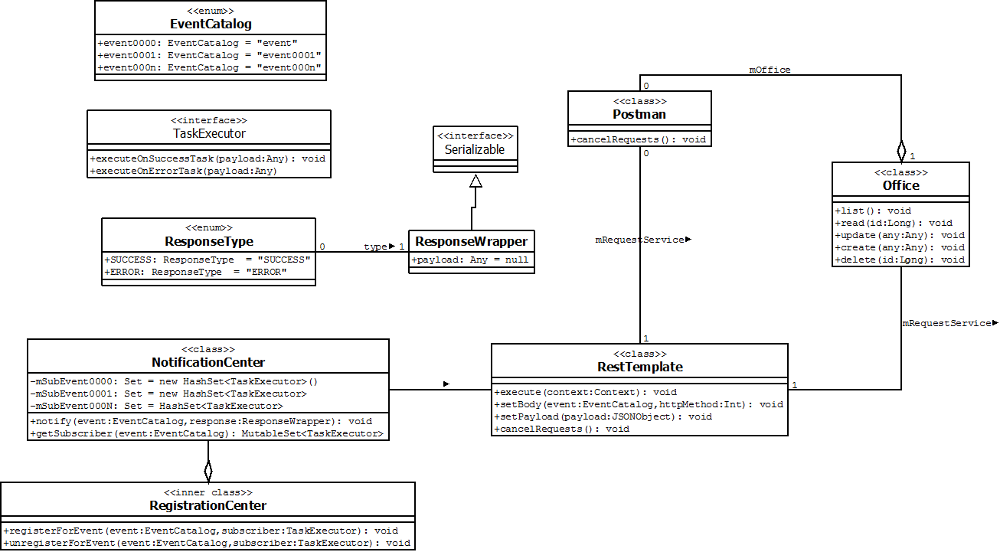
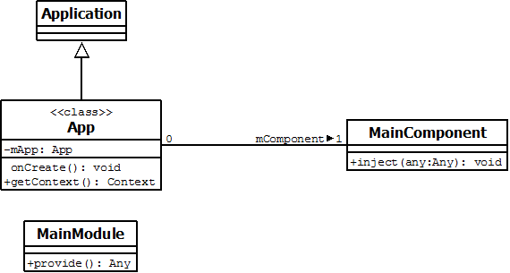
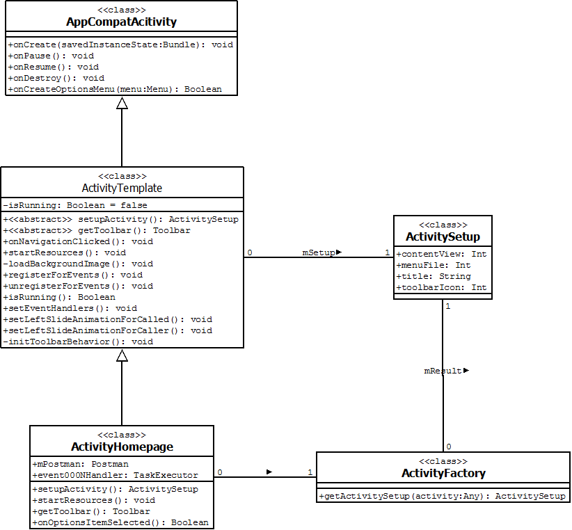

# MovieDB

This application is a showcase example for an aplication with the following requirements:

**FUNCTIONAL REQUIREMENTS**
The first release of the app will be very limited in scope, but will serve as the foundation for future releases. It's
expected that user will be able to:
 - Scroll through the list of upcoming movies (limited to the first 50 movies) ­ including movie name, poster
image, genre and release date. This list should be ordered through release date in an increasing order.
 - Select a specific movie to see details (name, poster image, genre, overview and release date).
 - Search for movies by entering a partial or full movie name.

**TECHNICAL REQUIREMENTS**
You should see this project as an opportunity to create an app following modern development best practices (given
your platform of choice), but also feel free to use your own app architecture preferences (coding standards, code
organization, third­party libraries, etc).

Showcase
---

  
  
  
  
  
  

Blueprints
---
Below there are a couple of blueprints that exposes the architecture adopted for this project:

**Communication Module**
----

  

Above it can be seen the infrastructure that rules the communication module for this project. The enum EventCatolog holds a symbol for every event that must be observed within the system. If any components need to be notified about a state change related to that event, it must call the RegistrationCenter and register for it. The class NotificationCenter acts as a bus that receives communication about any state change related to a specific event. It holds the set of subscribers for that change and notify them through the TaskExecutor interface - a payload derived from the Any (Object) class is passed as parameter to the subscriber which knows how to handle it. By last, the Postman class is known by any part of the system as the facade capable to delivery and execute any webservice call. The actual implementation of the call is delegated to the specific Office class which, by its turn, use the methods from RestTemplate to correct manage the request build and execution.

**_Adopted Design Patterns:_** Observer, Delegate, Façade

**App infrastructure and Dependency Injection**
----

  

Throughout the application it is common the need to have a reference to a Context object, mainly in order to get access to resource files. The App class hold this as one of its main responsabilities. One important feature to take in account when programming is the need to invert the dependency of the classes. High level classes must not know a lot about low level implementation logic. A tool that helps to reach this behaviour is the Dependency Injection and, for the Android environment, Dagger 2 rises as the best choice to do so. The classes MainComponente and MainModule are part of the Dagger 2 ecossystem and are responsible for either, provide an Object instantiation or to inject them on a given class.

**_Adopted Design Patterns:_** Dependency Inversion Principle - 'D' letter from the S.O.L.I.D. principles.

**Controller implementation**
----

  

The diagram above display the a generic implementation used in this project. The ActivityTemplate class provides common processing blocks for all app Activities - such as holding the information that tells if that Activity is in Foreground or not. Hence, all Activity implementation must descend of it. ActivityFactory is a place that centers all Activity setup, making easy to change some aspect of the application later on.

**_Adopted Design Patterns:_** Template, Factory

Tests
---
The majority of this application effort is dedicated to map data between webservice's result and UI elements and, as there are many reliable libraries to do so, such as Gson and Kotlin internal features like 'data class', this work is facilitaded a lot. Because of that the tests were concentrated in automate the UI behaviour - using the test environment of Android with help of third libraries like Espresso. Mockito library is intended to be used to increase the Unit Test coverage of this application, it can make a good match with the already in use Dagger 2.

Third-party libraries and special thanks
---
A full list of all third party libraries used throughout this project can be found at the About Activity present inside the App, however, a few mentions can be found below:

 - **Dagger 2**: Dependency Injector for Androd and Java, used to grant one of the S.O.L.I.D. principles for OO programming (Dependency Inversion Principle). Besides allowing the high level class to not depend upon low level ones, it makes Unit Test easier to perform with the help of a mocking framework i.e. Mockito;
 - **Gson**: Java library that can be used to convert Java Objects into their JSON representation. Used largely for consuming the payload of The Movie DB API;
 - **Material Dialog**: Android Library for using Honeycomb (Android 3.0) animation API on all version of the platform back to 1.0;
 - **Android Support Collection**: provided commom elements of design for build Android applications;
 - **Volley Plus**: Android library that provide usefull task to deal with webservices;
 - **Kotlin**: Kotlin is a statically typed language that targets the JVM and JavaScript. It is a general-purpose language intended for industry use. It is developed by a team at JetBrains although it is an OSS language and has external contributors. Besides the imports present in the App gradle file, it is required to download the plugins for Android Studio in order to compile the .kt classes and make the project work;
 - **Anko**: Anko is a library which makes Android application development faster and easier. It makes your code clean and easy to read, and lets you forget about rough edges of Android SDK for Java.

 
Code license
---
Copyright 2016 Edgar da Silva Fernandes

Licensed under the Apache License, Version 2.0 (the "License");
you may not use this file except in compliance with the License.
You may obtain a copy of the License at

    http://www.apache.org/licenses/LICENSE-2.0

Unless required by applicable law or agreed to in writing, software
distributed under the License is distributed on an "AS IS" BASIS,
WITHOUT WARRANTIES OR CONDITIONS OF ANY KIND, either express or implied.
See the License for the specific language governing permissions and
limitations under the License.
